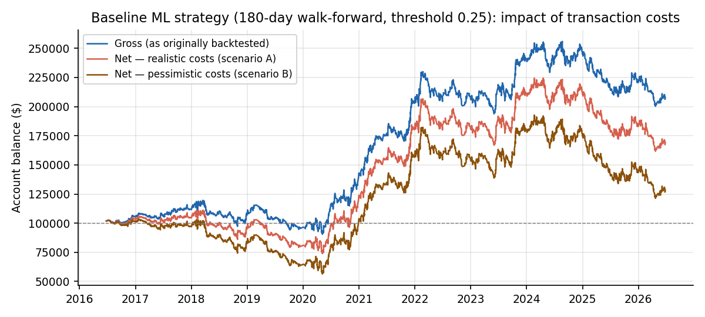
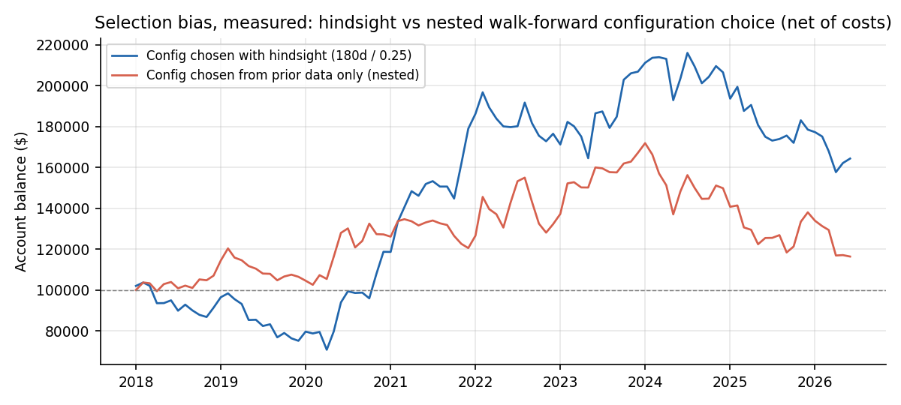

# ICT Liquidity-Sweep Strategies on Nasdaq Futures — A Rigorous Negative Result

An 11-year systematic evaluation (2015–2026, 3.79M one-minute bars) of whether "Smart Money Concepts" (ICT) — liquidity sweeps, breaks of structure, fair value gaps, order blocks, and higher-timeframe bias — can be automated into a profitable trading system on NQ/MNQ futures.

Conclusion: ICT concepts cannot be automated in a profitable way. This repository details how I implemented Smart Money Concepts as a trading bot, how incorrect statistical backtests of a walk-forward LightGBM strategy suggested returns of +17.7%/yr at a 0.96 Sharpe ratio, and how rigorous validation tests reduced reported returns to a more honest, cost-adjusted, selection-bias-corrected Sharpe of 0.2, with no edge at all in the most recent 3.5 years. An additional implementation of a publicly-taught top-down ICT playbook performed indistinguishably from random entries, serving as further evidence that ICT concepts have no statistical edge in the NQ futures market.

📄 **Read the full study:** [`docs/ICT_Research_Report.docx`](docs/ICT_Research_Report.docx)



## Where the 17.7% went

| Correction | Effect |
| --- | --- |
| Corrected metric conventions (pooled Sharpe, full-period drawdown) | 0.96 → ~0.6 Sharpe, Calmar ~1.5 → ~0.3 |
| Transaction costs (NQ commissions + slippage) | 36–74% of gross per-trade edge |
| Nested (prior-data-only) configuration selection | ~half of net performance |
| Model implementation swap test | gross edge not reproducible (17.7% → ~4.5%/yr at matched trade count) |
| Regime concentration | profits confined to 2019–2022; ≈0 net edge since 2023 |



**Companion study:** the same validation tests applied to the overnight return premium in NQ/ES futures lives in its own repository (`overnight-returns-futures`): a positive result, with honestly measured application limits.

## Repository layout

```
src/        Core engine: feature translation (Pine→Python), labeling pipeline,
            walk-forward validation, backtester, metrics, and both strategies
            (ML baseline: run_baseline_backtest.py; top-down: htf_bias_strategy.py)
tests/      Unit tests for the pipeline, backtester, and feature translation (pytest)
docs/       Research report (.docx), experiment history (17 phases), validation
            results, baseline record, and all figures
examples/   Small demo datasets for running the pipeline without full market data
data/       Market data (gitignored, ~1.6 GB — see data/README.md to rebuild)
archive/    Frozen artifacts of all 17 research phases: scripts, raw result files,
            and superseded strategy versions
```

## Reproducing

```bash
pip install pandas numpy lightgbm matplotlib pytz
# demo (no market data needed):
python src/pipeline.py --input examples/demo_tv_export.csv --output /tmp/demo_ml.csv
pytest                       # unit tests
# full baseline backtest (requires data/ - see data/README.md):
python src/run_baseline_backtest.py
python src/htf_bias_strategy.py
```

## Key methodological takeaways

Average-of-yearly Sharpe ratios and averaged yearly drawdowns systematically overstate performance. Configuration selection bias is measurable with a nested walk-forward and, here, erased half the result. Retraining with an equivalently-specified model from a different codebase is a powerful overfitting detector. With fixed per-trade frictions, trade frequency is a liability for thin-edge signals. Random-entry benchmarks with identical exit machinery isolate whether entry logic contributes anything. And negative results only retain value if they're recorded - all 17 phases are documented in [`docs/EXPERIMENT_HISTORY.md`](docs/EXPERIMENT_HISTORY.md).

*Not financial advice. Built for research purposes.*
