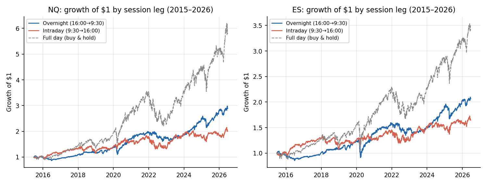

# Overnight vs. Intraday Returns in Equity Index Futures (2015–2026)

A replication study of the documented "overnight return premium" (Cliff, Cooper & Gulen 2008; Lou, Polk & Skouras, *JFE* 2019) on tradeable futures prices — the second study in this repository, run with the same validation standards as the ICT falsification study. Engine: `src/overnight_intraday_study.py`.

## Why this study, and why futures

The classic literature splits each day at the cash-market open and close and finds that, in US equity indices, nearly all long-run returns historically accrued overnight (close→open) while intraday (open→close) averaged near zero. It is an ideal follow-up to the ICT project for one structural reason: the partition is defined by the clock. There are no thresholds, windows, or rule definitions to choose — nothing to overfit, no researcher degrees of freedom.

Futures add two things the equity-based literature lacks. First, measurement: NQ/ES trade ~23 hours a day, so both legs are computed from actually tradeable prices rather than untradeable close-to-open gaps. Second, interpretation: because futures traders *can* react to news overnight, any premium that persists in futures is evidence against the simple "compensation for being locked in while the market is closed" story, and consistent with the clientele-based explanation of Lou, Polk & Skouras.

## Pre-registered design

Fixed before any results were computed: overnight = 16:00→9:30 ET (literature convention), intraday = 9:30→16:00; fills at the first 1-minute close at/after each boundary (30-minute tolerance drops holidays/half-days); both NQ and ES over all 2,674 overlapping trading days (Jun 2015 – Jun 2026); costs for the tradability test = one round-trip per day (all-in commission + 1 tick slippage per side); circular block bootstrap (21-day blocks, 10k reps) for inference; one a-priori subperiod split at 2020-12-31. No parameters were swept.

## Results

| | NQ overnight | NQ intraday | ES overnight | ES intraday |
| --- | --- | --- | --- | --- |
| Mean bp/day | +4.34 | +3.18 | +2.98 | +2.21 |
| Annualized | +11.6% | +8.3% | +7.8% | +5.7% |
| 90% bootstrap CI (bp) | [+1.9, +6.8] | [+0.2, +6.1] | [+0.7, +5.2] | [−0.1, +4.4] |
| P(mean ≤ 0) | 0.3% | 3.9% | 2.1% | 5.6% |
| Volatility (ann.) | 13.8% | 17.0% | 11.7% | 13.1% |
| Monthly Sharpe | 0.87 | 0.52 | 0.65 | 0.46 |
| Growth of $1 (11y) | $2.89 | $2.00 | $2.06 | $1.65 |

**The direction replicates; the strong form does not.** Overnight beat intraday on both instruments while carrying *less* volatility — the Sharpe gap (0.87 vs 0.52 on NQ) is much wider than the return gap, and the compounding gap is large ($2.89 vs $2.00 per dollar over 11 years). But the classic strong-form claim — intraday ≈ zero — does not hold in this modern sample: intraday was solidly positive on NQ and marginally so on ES, consistent with published anomalies attenuating after publication.

**Stability.** Unlike anything in the ICT study, the overnight premium is stable across the pre-registered halves: +4.40 bp/day before 2021, +4.28 after (NQ). It survived 2022's bear market better than the intraday leg (−5.0 vs −9.8 bp/day).

## Tradability

| Overnight-only strategy (net of daily costs) | NQ | ES |
| --- | --- | --- |
| Avg cost per day | 0.81 bp | 1.78 bp |
| Net return | +3.53 bp/day = **+9.3%/yr** | +1.21 bp/day = +3.1%/yr |
| 90% CI (bp) | [+1.0, +5.9] | [−1.2, +3.4] |
| P(≤ 0) | 1.1% | **19.7%** |
| Monthly Sharpe | 0.71 | 0.26 |

Three honest conclusions. On NQ the overnight-only strategy is statistically real after costs (P(≤0) = 1.1%) — a genuine contrast with every ICT result in this repository. However, it does not beat buy-and-hold (+20.9%/yr, 0.96 Sharpe, no daily costs) in this sample, so it is a risk-reduction tilt, not an outperformance strategy. And on ES the premium does not survive costs at all — ES's proportionally heavier frictions and smaller premium leave it statistically indistinguishable from zero.

## Discussion

The result lands between the literature's strong claim and a null: a real, stable, statistically significant overnight premium exists in modern NQ futures, but it is smaller than the 1993–2008 equity-market era suggested and is not, by itself, a reason to trade rather than hold. The persistence of the premium in a venue where overnight trading is fully possible argues against pure inaccessibility-risk explanations and is consistent with the clientele mechanism of Lou, Polk & Skouras.

A calibration note worth stating explicitly: a ~3%/yr return gap between legs sounds small next to the +17.7%/yr the ICT backtest once claimed. The difference is that this gap is real — it survives bootstrap inference, costs, and a pre-registered subperiod split. Real systematic edges are small; that is precisely why transaction costs and statistical honesty, not indicator creativity, decide what is tradeable.

**Limitations:** unadjusted continuous contracts (roll gaps land inside the overnight leg; quarterly, small relative to leg vol); a single asset class in a predominantly bull-market sample; no financing/margin modeling (futures margin is modest, but capital efficiency differs from cash equities); boundary fills assume execution at the first 1-minute close, i.e. marketable orders at the boundary.
